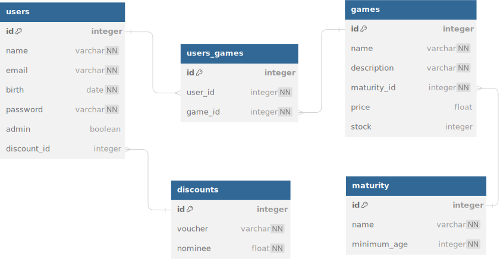

# Perang Kode

Merupakan proyek CLI berbasis Go yang mensimulasikan e-commerce game seperti Steam Store.\
Disusun sebagai milestone Fase 1 FTGO Hacktiv8.

### Kontributor:

- Dani Munandar
- Daniel Osvaldo Rahmanto

### Disusun menggunakan:


## Instalasi & Pemakaian

Gunakan command di bawah ini ke dalam terminal satu folder yang sudah terinisiasi `go.mod`

```console
go get -u github.com/Tango992/perang-kode@latest
```

Lakukan `go mod tidy` setelah mengimport package ke dalam `main.go` anda.

Jalankan `perangkode.Run(url string)` untuk memulai program.

Untuk saat ini, URL database bersifat rahasia untuk penggunaan terbatas.

```go
import "github.com/Tango992/perang-kode"

func main() {
    dbUrl := "[USERNAME]:[PASSWORD]@tcp([HOST]:[PORT])/[DBNAME]"
    perangkode.Run(dbUrl)
}
```

## Highlights

### Role Based Menu

#### Menu untuk user

```console
Selamat datang John Doe!
1. Tampilkan semua game
2. Tampilkan cart
3. Tambah game ke cart
4. Hapus game dari cart
5. Get Voucher
6. Log Out
Masukkan pilihan sub-menu (1/2/3/4/5/6): 
```

#### Menu untuk admin

```console
Selamat datang Admin!
1. Update stock game
2. Tampilkan report user
3. Tampilkan report order
4. Tampilkan report stock
5. Log Out
Masukkan pilihan sub-menu admin (1/2/3/4/5): 
```

### Table View

Tersedia dalam beberapa sub-menu.

```console
Cart Anda:
-------------------------------------------------
| ID  | Nama                 | Harga  |
-------------------------------------------------
| 1   | Counter Strike 2     | Free   |
| 2   | Grand Theft Auto V   | 30.00  |
-------------------------------------------------
                    Subtotal   30.00
                     Voucher   PERANGKODE        
                    Discount   15.00%

                 Grand Total   25.50
-------------------------------------------------
```

## Struktur Database

### Inisiasi Tabel

#### Discounts

- Id (primary key)
- Voucher
- Nominee 

#### Users

- Id (Primary Key)
- Name
- Email
- Birth
- Password
- Admin
- Discount_Id (Foreign Key)

#### Maturity

- Id (Primary Key)
- Name
- Minimum_age

#### Games

- Id (Primary Key)
- Name
- Maturity Id (Foreign Key)
- Price
- Stock

#### Users_Games

- Id (Primary Key)
- User_Id (Foreign Key)
- Game_id (Foreign Key)

### Cardinality

#### Tabel Users & Games

- Relasi : Many to many
- Deskripsi : Satu user dapat memiliki beberapa games dan game dapat dimiliki oleh beberapa user.\
Oleh sebab itu, dibutuhkan tabel junction bernama Users_Games

#### Tabel Users dan Users_Games

- Relasi : One to many
- Deskripsi : Satu user dapat memiliki beberapa game. Merupakan hasil tabel junction dari Tabel Users & Games.

#### Tabel Games dan Users_Games

- Relasi : One to many
- Deskripsi : Satu game dapat memiliki beberapa user. Merupakan hasil tabel junction dari Tabel Users & Games.

#### Tabel Maturity dan Games

- Relasi : One to many
- Deskripsi : Satu rating maturity dapat dimiliki beberapa game.

#### Tabel Discount dan Users

- Relasi : One to many
- Deskripsi : Satu voucher discount dapat dimiliki oleh beberapa user.

### SQL Queries

```sql
-- DDL
CREATE TABLE discounts (
    id INT AUTO_INCREMENT NOT NULL,
    voucher VARCHAR(100) NOT NULL,
    nominee FLOAT NOT NULL,
    PRIMARY KEY (id)
);

CREATE TABLE users (
    id INT AUTO_INCREMENT NOT NULL,
    name VARCHAR(100) NOT NULL,
    email VARCHAR(100) NOT NULL UNIQUE,
    birth DATE NOT NULL,
    password VARCHAR(100) NOT NULL,
    admin BOOLEAN DEFAULT 0 NOT NULL,
    discount_id INT,
    PRIMARY KEY (id),
    FOREIGN KEY (discount_id) REFERENCES discounts(id)
);

CREATE TABLE maturity (
    id INT AUTO_INCREMENT NOT NULL,
    name VARCHAR(100) NOT NULL,
    minimum_age INT NOT NULL,
    PRIMARY KEY (id)
);

CREATE TABLE games (
    id INT AUTO_INCREMENT NOT NULL,
    name VARCHAR(100) NOT NULL,
    description VARCHAR(255) NOT NULL,
    maturity_id INT NOT NULL,
    price FLOAT UNSIGNED,
    stock INT UNSIGNED,
    PRIMARY KEY (id),
    FOREIGN KEY (maturity_id) REFERENCES maturity(id)
);

CREATE TABLE users_games (
    id INT AUTO_INCREMENT NOT NULL,
    user_id INT NOT NULL,
    game_id INT NOT NULL,
    PRIMARY KEY (id),
    FOREIGN KEY (user_id) REFERENCES users(id),
    FOREIGN KEY (game_id) REFERENCES games(id)
);

-- DML
INSERT INTO discounts (voucher, nominee)
VALUES 
    ("GAMERS", 0.10),
    ("GAMERSINDO", 0.08),
    ("PERANGKODE", 0.15);

INSERT INTO maturity (name, minimum_age)
VALUES
    ("Everyone", 0),
    ("Teen", 13),
    ("Mature", 17),
    ("Adults", 21);

INSERT INTO games (name, description, maturity_id, price, stock)
VALUES 
    ("Counter Strike 2", "For over two decades, Counter-Strike has offered an elite competitive experience, one shaped by millions of players from across the globe. And now the next chapter in the CS story is about to begin. This is Counter-Strike 2.", 3, 0, 100),
    ("Grand Theft Auto V", "Grand Theft Auto V for PC offers players the option to explore the award-winning world of Los Santos and Blaine County in resolutions of up to 4k and beyond, as well as the chance to experience the game running at 60 frames per second.", 4, 30.00, 100),
    ("Stumble Guys", "Race through obstacle courses against up to 32 players online. Run, jump and dash to the finish line until the best player takes the crown!", 1, 15.00, 100),
    ("Forza Horizon 5", "Your Ultimate Horizon Adventure awaits! Explore the vibrant open world landscapes of Mexico with limitless, fun driving action in the worlds greatest cars.", 2, 50.00, 100);
```

### Entity Relationship Diagram

